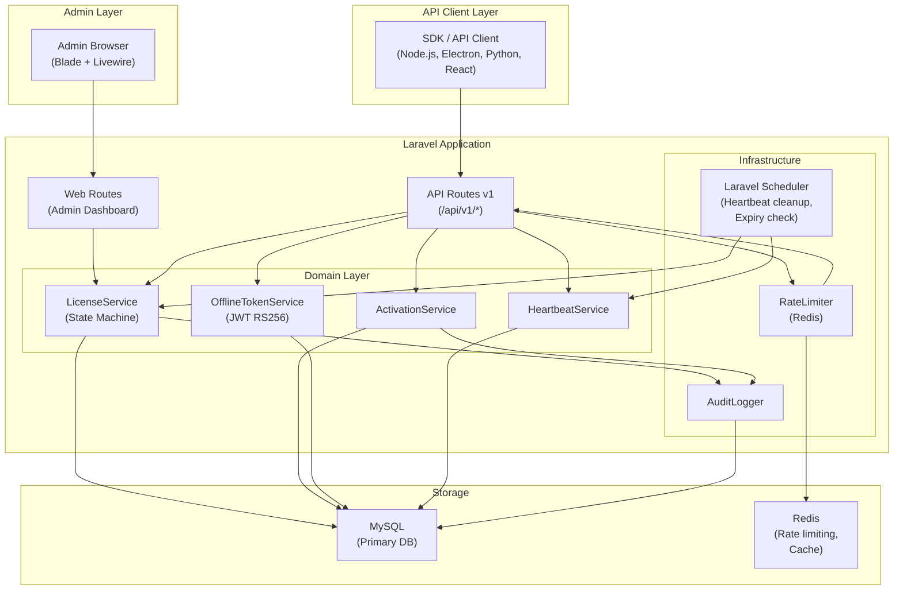

# Tài Liệu Thiết Kế — License Platform

## Tổng Quan

License Platform là một hệ thống quản lý license key toàn diện xây dựng trên Laravel. Hệ thống phục vụ hai nhóm người dùng chính: **Admin** quản lý sản phẩm và license qua web dashboard, và **API Client** (ứng dụng phần mềm của khách hàng) tích hợp qua REST API để kích hoạt và xác thực license.

### Mục tiêu thiết kế

- **Bảo mật**: License key không lưu plaintext; JWT offline token ký RS256; device fingerprint lưu dạng hash SHA-256.
- **Tính đúng đắn**: Mọi chuyển đổi trạng thái license đi qua state machine, không bypass.
- **Khả năng mở rộng**: Rate limiting qua Redis, concurrency an toàn bằng DB transaction + unique constraint.
- **Offline-first**: Sau khi activate, client có thể xác thực cục bộ bằng JWT token trong thời gian TTL.

### Nguyên tắc phân tầng (bắt buộc)

- **Domain service** (`LicenseService`, `ActivationService`, v.v.) không được gọi trực tiếp `Request`, `Response`, Redis, hay HTTP client. Mọi dependency ngoài DB phải đi qua interface/adapter được inject.
- **Controller phải cực mỏng**: resolve DTO từ request → gọi domain service → map result → trả JSON. Không chứa business logic.
- **Infrastructure** (Redis, AuditLogger, Scheduler) là adapter, không phải domain. Domain service nhận interface, không nhận concrete class.

### Phạm vi

Hệ thống bao gồm:

1. Web dashboard cho Admin (Laravel Blade + Livewire/Alpine.js)
2. REST API v1 cho API Client
3. State machine quản lý vòng đời license
4. Cơ chế offline validation bằng JWT RS256
5. Heartbeat mechanism cho floating license
6. Audit logging toàn diện

---

## Kiến Trúc

### Kiến trúc tổng thể



### Luồng xử lý chính

**Activation flow:**

```
API Client → POST /api/v1/licenses/activate
  → RateLimiter (Redis, by X-API-Key)
  → Authenticate X-API-Key → resolve Product
  → ActivationService::activate(licenseKey, fingerprint, model)
    → DB Transaction:
        → LicenseService::validateForActivation()
        → Create/find Activation record (unique constraint)
        → LicenseService::activate() [state machine]
        → OfflineTokenService::issue(activation)
    → AuditLogger::log(ACTIVATION_SUCCESS)
  → Return { offline_token, ... }
```

**Offline validation flow (client-side):**

```
SDK → verify JWT signature (RS256, hardcoded alg)
    → check exp, nbf, iss, aud
    → compare device_fp_hash with current fingerprint
    → check exp - iat <= product Offline_Token_TTL
    → if valid: allow usage
    → if online: refresh token before 20% TTL remaining
```

---

## Các Thành Phần và Giao Diện

### 1. State Machine (LicenseStateMachine)

Triển khai bằng `spatie/laravel-model-states`. Mỗi trạng thái là một class riêng.

```
App\States\License\
  ├── InactiveState
  ├── ActiveState
  ├── ExpiredState
  ├── SuspendedState
  └── RevokedState
```

Mỗi state class implement interface sau để phân tán logic vào từng state, không dồn vào service:

```php
interface LicenseStateContract {
    public function canActivate(): bool;
    public function canSuspend(): bool;
    public function canRevoke(): bool;
    public function canRestore(): bool;
    public function canRenew(): bool;
    public function canUnrevoke(): bool;
}
```

Controller chỉ gọi `LicenseService::revoke($license)`, không gọi `$license->update(['status' => 'revoked'])` trực tiếp.

**Các transition hợp lệ:**

| Từ trạng thái | Hành động | Sang trạng thái | Ghi chú                                    |
| ------------- | --------- | --------------- | ------------------------------------------ |
| `inactive`    | activate  | `active`        |                                            |
| `active`      | expire    | `expired`       | Tự động qua scheduler                      |
| `active`      | suspend   | `suspended`     | Vô hiệu hóa tất cả activation ngay lập tức |
| `active`      | revoke    | `revoked`       | Hủy tất cả activation                      |
| `expired`     | renew     | `suspended`     | Cần restore thủ công sau khi gia hạn       |
| `suspended`   | restore   | `active`        | Chỉ khi Expiry_Date chưa qua               |
| `suspended`   | revoke    | `revoked`       |                                            |
| `suspended`   | renew     | `suspended`     | Chỉ cập nhật Expiry_Date                   |
| `inactive`    | revoke    | `revoked`       |                                            |
| `revoked`     | un-revoke | `inactive`      |                                            |

Mọi transition không nằm trong bảng trên đều bị từ chối với lỗi `TRANSITION_NOT_ALLOWED`.

**Transition hooks** (thực thi trong DB transaction):

- `onSuspend`: vô hiệu hóa tất cả activation, đánh dấu JTI của offline token là invalid
- `onRevoke`: hủy tất cả activation, đánh dấu JTI invalid
- `onRestore`: kiểm tra Expiry_Date, nếu đã qua thì throw `LicenseExpiredException`
- `onExpire`: cập nhật trạng thái, từ chối validation tiếp theo
- `onUnrevoke`: chuyển về `inactive`, ghi audit log

### 2. API Layer

**Middleware stack cho API routes:**

```
api → throttle:api_key → auth:api_key → json_response
```

**Controllers:**

- `LicenseController` — activate, validate, deactivate, info, transfer
- `HeartbeatController` — heartbeat
- `PublicKeyController` — public key endpoint (no auth)

**Middleware `auth:api_key`:**

- Resolve `Product` từ giá trị `X-API-Key` header
- Inject product vào request: `$request->attributes->set('product', $product)`
- Trả về `UNAUTHORIZED` (401) nếu API key không tồn tại hoặc product bị soft delete

**VALIDATION_ERROR response format:**

```json
{
  "success": false,
  "data": null,
  "error": {
    "code": "VALIDATION_ERROR",
    "message": "Dữ liệu đầu vào không hợp lệ",
    "details": {
      "license_key": ["License key không đúng định dạng"],
      "device_fingerprint": ["Trường này là bắt buộc"]
    }
  }
}
```

`error.details` chỉ có mặt khi `code = VALIDATION_ERROR`.

**Request/Response format:**

```json
// Success
{
  "success": true,
  "data": { ... },
  "error": null
}

// Error
{
  "success": false,
  "data": null,
  "error": {
    "code": "LICENSE_EXPIRED",
    "message": "License key đã hết hạn"
  }
}
```

Mỗi response bao gồm header `X-Request-ID` (UUID v4).

### 3. OfflineTokenService

Phát hành JWT RS256 sau khi activation thành công.

**Claims bắt buộc:**

```json
{
  "iss": "license-platform",
  "aud": "product-slug",
  "sub": "sha256(license_key_plaintext)",
  "jti": "uuid-v4",
  "iat": 1700000000,
  "nbf": 1700000000,
  "exp": 1700086400,
  "device_fp_hash": "sha256(device_fingerprint)",
  "license_model": "per-device",
  "license_expiry": "2025-12-31T23:59:59Z"
}
```

**Bảo mật:**

- Private key lưu trong environment variable, không commit vào source code
- `alg` hardcoded là `RS256` khi verify, không đọc từ JWT header
- `jti` lưu vào bảng `offline_token_jti` để hỗ trợ revocation
- TTL cấu hình per-product: mặc định 24h, min 1h, max 7 ngày

**Refresh semantics:**

- Server chấp nhận refresh bất kỳ lúc nào trước `exp` — không giới hạn tần suất
- Khi refresh, JTI cũ **vẫn còn hiệu lực** cho đến khi hết hạn tự nhiên (`expires_at`); chỉ bị revoke khi license bị suspend/revoke
- Trade-off: refresh dày sẽ tạo nhiều JTI records hơn; cleanup job dọn dẹp các JTI đã hết hạn theo `expires_at`
- **Offline enforcement là "eventual"**: revoke/suspend có hiệu lực ngay trên server, nhưng SDK offline chỉ nhận trạng thái mới khi thực hiện refresh online tiếp theo; độ trễ tối đa = TTL còn lại của token hiện tại

### 4. HeartbeatService

Quản lý vòng đời của floating license seats.

**Semantics rõ ràng:**

- `Activation` = license đã gán cho device, tồn tại lâu dài để track lịch sử (kể cả khi device offline)
- `FloatingSeat` = device đang online/đang dùng, ephemeral — mất sau 10 phút không heartbeat

**Flow:**

```
activate  → tạo Activation record (type=floating) + tạo FloatingSeat record
heartbeat → cập nhật FloatingSeat.last_heartbeat_at
timeout   → scheduler xóa FloatingSeat (Activation vẫn còn để track lịch sử)
deactivate/checkout → xóa FloatingSeat (Activation vẫn còn)
admin revoke activation → xóa FloatingSeat + đánh dấu Activation.is_active = false
```

- Client gửi heartbeat mỗi ≤ 5 phút
- Scheduler chạy mỗi phút, giải phóng seat không heartbeat trong > 10 phút
- Check-out explicit khi client đóng ứng dụng

### 5. AuditLogger

Ghi log bất đồng bộ (queue job) để không ảnh hưởng latency API.

**Sự kiện được ghi:**

- `PRODUCT_CREATED`, `PRODUCT_UPDATED`, `PRODUCT_DELETED`
- `LICENSE_CREATED`, `LICENSE_REVOKED`, `LICENSE_SUSPENDED`, `LICENSE_RESTORED`, `LICENSE_RENEWED`, `LICENSE_UNREVOKED`
- `ACTIVATION_SUCCESS`, `ACTIVATION_FAILED`
- `VALIDATION_FAILED` (liên tiếp)
- `ADMIN_LOGIN`, `ADMIN_LOGIN_FAILED`, `ADMIN_LOCKED`
- `ACTIVATION_REVOKED`

### 6. Admin Dashboard

Xây dựng bằng Laravel Blade + Livewire cho các tính năng real-time (search, filter).

**Trang chính:**

- Dashboard: metrics tổng quan + biểu đồ (Chart.js)
- Products: CRUD, toggle status
- Licenses: list, search, filter, batch create, export CSV
- License Detail: activations, lifecycle actions, audit log
- Audit Log: filter, search

---

## Mô Hình Dữ Liệu

### ERD tổng quan

```mermaid
erDiagram
    products {
        bigint id PK
        string name
        string slug UK
        text description
        string logo_url
        json platforms
        string status
        int offline_token_ttl_hours
        string api_key UK
        timestamp deleted_at
        timestamps
    }

    licenses {
        bigint id PK
        bigint product_id FK
        string key_hash UK
        string key_last4
        string license_model
        string status
        int max_seats
        date expiry_date
        string customer_name
        string customer_email
        text notes
        timestamp deleted_at
        timestamps
    }

    activations {
        bigint id PK
        bigint license_id FK
        string device_fp_hash
        string user_identifier
        string type
        timestamp activated_at
        timestamp last_verified_at
        boolean is_active
        timestamps
    }

    floating_seats {
        bigint id PK
        bigint license_id FK
        bigint activation_id FK
        string device_fp_hash UK
        timestamp last_heartbeat_at
        timestamps
    }

    offline_token_jti {
        bigint id PK
        bigint license_id FK
        string jti UK
        timestamp expires_at
        boolean is_revoked
        timestamps
    }

    audit_logs {
        bigint id PK
        string event_type
        string subject_type
        bigint subject_id
        string ip_address
        json payload
        string result
        string severity
        timestamps
    }

    products ||--o{ licenses : "has"
    licenses ||--o{ activations : "has"
    licenses ||--o{ floating_seats : "has"
    activations ||--o{ floating_seats : "has"
    licenses ||--o{ offline_token_jti : "has"
```

### Chi tiết bảng

#### `products`

| Cột                        | Kiểu                      | Ràng buộc                  | Mô tả                                         |
| -------------------------- | ------------------------- | -------------------------- | --------------------------------------------- |
| `id`                       | BIGINT UNSIGNED           | PK, AUTO_INCREMENT         |                                               |
| `name`                     | VARCHAR(255)              | NOT NULL                   | Tên sản phẩm                                  |
| `slug`                     | VARCHAR(255)              | UNIQUE, NOT NULL           | Mã sản phẩm (lowercase, alphanumeric, dashes) |
| `description`              | TEXT                      | NULLABLE                   | Mô tả sản phẩm                                |
| `logo_url`                 | VARCHAR(2048)             | NULLABLE                   | URL logo                                      |
| `platforms`                | JSON                      | NULLABLE                   | Mảng platform hỗ trợ                          |
| `status`                   | ENUM('active','inactive') | NOT NULL, DEFAULT 'active' |                                               |
| `offline_token_ttl_hours`  | SMALLINT UNSIGNED         | NOT NULL, DEFAULT 24       | Min 1, max 168 (7 ngày)                       |
| `api_key`                  | VARCHAR(64)               | UNIQUE, NOT NULL           | API key cho product                           |
| `deleted_at`               | TIMESTAMP                 | NULLABLE                   | Soft delete                                   |
| `created_at`, `updated_at` | TIMESTAMP                 |                            |                                               |

**Indexes:** `slug` (unique), `api_key` (unique), `status`

#### `licenses`

| Cột                        | Kiểu                                                      | Ràng buộc                    | Mô tả                             |
| -------------------------- | --------------------------------------------------------- | ---------------------------- | --------------------------------- |
| `id`                       | BIGINT UNSIGNED                                           | PK                           |                                   |
| `product_id`               | BIGINT UNSIGNED                                           | FK → products.id, NOT NULL   |                                   |
| `key_hash`                 | CHAR(64)                                                  | UNIQUE, NOT NULL             | SHA-256 của license key plaintext |
| `key_last4`                | CHAR(4)                                                   | NOT NULL                     | 4 ký tự cuối plaintext            |
| `license_model`            | ENUM('per-device','per-user','floating')                  | NOT NULL                     |                                   |
| `status`                   | ENUM('inactive','active','expired','revoked','suspended') | NOT NULL, DEFAULT 'inactive' |                                   |
| `max_seats`                | SMALLINT UNSIGNED                                         | NULLABLE                     | Chỉ dùng cho floating             |
| `expiry_date`              | DATE                                                      | NULLABLE                     | NULL = vĩnh viễn                  |
| `customer_name`            | VARCHAR(255)                                              | NULLABLE                     |                                   |
| `customer_email`           | VARCHAR(255)                                              | NULLABLE                     |                                   |
| `notes`                    | TEXT                                                      | NULLABLE                     | Chỉ hiển thị trong Admin          |
| `deleted_at`               | TIMESTAMP                                                 | NULLABLE                     | Soft delete                       |
| `created_at`, `updated_at` | TIMESTAMP                                                 |                              |                                   |

**Indexes:** `key_hash` (unique), `product_id`, `status`, `expiry_date`, `(product_id, status)`

**Quy tắc soft delete cho License:**

- Soft delete (`deleted_at IS NOT NULL`) chỉ ẩn license khỏi Admin UI
- API validate/activate với license bị soft delete trả về `LICENSE_REVOKED` (422) — treated as revoked
- Không trả về `LICENSE_NOT_FOUND` (404) để tránh information leakage về sự tồn tại của key

| Cột                        | Kiểu                                     | Ràng buộc                  | Mô tả                          |
| -------------------------- | ---------------------------------------- | -------------------------- | ------------------------------ |
| `id`                       | BIGINT UNSIGNED                          | PK                         |                                |
| `license_id`               | BIGINT UNSIGNED                          | FK → licenses.id, NOT NULL |                                |
| `device_fp_hash`           | CHAR(64)                                 | NULLABLE                   | SHA-256 của device fingerprint |
| `user_identifier`          | VARCHAR(255)                             | NULLABLE                   | Cho per-user license           |
| `type`                     | ENUM('per-device','per-user','floating') | NOT NULL                   |                                |
| `activated_at`             | TIMESTAMP                                | NOT NULL                   |                                |
| `last_verified_at`         | TIMESTAMP                                | NULLABLE                   |                                |
| `is_active`                | BOOLEAN                                  | NOT NULL, DEFAULT TRUE     |                                |
| `created_at`, `updated_at` | TIMESTAMP                                |                            |                                |

**Indexes:**

- `UNIQUE(license_id, device_fp_hash)` — ngăn duplicate per-device activation
- `UNIQUE(license_id, user_identifier)` — ngăn duplicate per-user activation
- `(license_id, is_active)`

#### `floating_seats`

| Cột                        | Kiểu            | Ràng buộc                     | Mô tả |
| -------------------------- | --------------- | ----------------------------- | ----- |
| `id`                       | BIGINT UNSIGNED | PK                            |       |
| `license_id`               | BIGINT UNSIGNED | FK → licenses.id, NOT NULL    |       |
| `activation_id`            | BIGINT UNSIGNED | FK → activations.id, NOT NULL |       |
| `device_fp_hash`           | CHAR(64)        | NOT NULL                      |       |
| `last_heartbeat_at`        | TIMESTAMP       | NOT NULL                      |       |
| `created_at`, `updated_at` | TIMESTAMP       |                               |       |

**Indexes:**

- `UNIQUE(license_id, device_fp_hash)` — ngăn duplicate seat
- `(license_id, last_heartbeat_at)` — cho heartbeat cleanup query

#### `offline_token_jti`

| Cột                        | Kiểu            | Ràng buộc                  | Mô tả           |
| -------------------------- | --------------- | -------------------------- | --------------- |
| `id`                       | BIGINT UNSIGNED | PK                         |                 |
| `license_id`               | BIGINT UNSIGNED | FK → licenses.id, NOT NULL |                 |
| `jti`                      | VARCHAR(36)     | UNIQUE, NOT NULL           | UUID v4         |
| `expires_at`               | TIMESTAMP       | NOT NULL                   | Dùng để cleanup |
| `is_revoked`               | BOOLEAN         | NOT NULL, DEFAULT FALSE    |                 |
| `created_at`, `updated_at` | TIMESTAMP       |                            |                 |

**Indexes:** `jti` (unique), `(license_id, is_revoked)`, `expires_at` (cho cleanup)

#### `audit_logs`

| Cột            | Kiểu                                        | Ràng buộc                | Mô tả                       |
| -------------- | ------------------------------------------- | ------------------------ | --------------------------- |
| `id`           | BIGINT UNSIGNED                             | PK                       |                             |
| `event_type`   | VARCHAR(64)                                 | NOT NULL                 | Ví dụ: `ACTIVATION_SUCCESS` |
| `subject_type` | ENUM('license','product','admin','api_key') | NULLABLE                 | Loại đối tượng liên quan    |
| `subject_id`   | BIGINT UNSIGNED                             | NULLABLE                 | ID của đối tượng liên quan  |
| `ip_address`   | VARCHAR(45)                                 | NULLABLE                 | IPv4 hoặc IPv6              |
| `payload`      | JSON                                        | NULLABLE                 | Dữ liệu bổ sung             |
| `result`       | ENUM('success','failure')                   | NOT NULL                 |                             |
| `severity`     | ENUM('info','warning','error')              | NOT NULL, DEFAULT 'info' |                             |
| `created_at`   | TIMESTAMP                                   | NOT NULL                 | Không có `updated_at`       |

**Indexes:** `event_type`, `subject_type + subject_id`, `ip_address`, `created_at`, `severity`

**Retention:** Tự động archive sau 365 ngày (scheduled job).

## Correctness Properties

_A property is a characteristic or behavior that should hold true across all valid executions of a system — essentially, a formal statement about what the system should do. Properties serve as the bridge between human-readable specifications and machine-verifiable correctness guarantees._

### Property 1: Product slug validation

_For any_ string submitted as a product slug, the system SHALL accept it if and only if it matches the pattern `^[a-z0-9][a-z0-9-]*[a-z0-9]$` (lowercase letters, digits, and hyphens only; no leading/trailing hyphens). Any string not matching this pattern SHALL be rejected with a validation error.

**Validates: Requirements 1.2**

---

### Property 2: Product slug uniqueness

_For any_ two product creation requests using the same slug value, the second request SHALL always be rejected with a validation error indicating the slug is already taken, regardless of other field values.

**Validates: Requirements 1.3**

---

### Property 3: Inactive product blocks new activations

_For any_ license key belonging to a product with status `inactive`, an activation request SHALL always be rejected with error code `PRODUCT_INACTIVE`, regardless of the license key's own status or the device fingerprint provided.

**Validates: Requirements 1.9, 1.11**

---

### Property 4: License key format and uniqueness

_For any_ batch of license keys generated by the system, every key SHALL match the format `^[A-Z0-9]{4}-[A-Z0-9]{4}-[A-Z0-9]{4}-[A-Z0-9]{4}$`, and no two keys in the entire system SHALL share the same plaintext value.

**Validates: Requirements 2.4, 2.5**

---

### Property 5: State machine enforces valid transitions only

_For any_ license in any state, only the transitions defined in the state machine table SHALL succeed; every other transition attempt SHALL be rejected with error code `TRANSITION_NOT_ALLOWED`. Specifically:

- From `inactive`: only `activate` and `revoke` are valid
- From `active`: only `expire`, `suspend`, and `revoke` are valid
- From `expired`: only `renew` is valid
- From `suspended`: only `restore`, `revoke`, and `renew` are valid
- From `revoked`: only `un-revoke` is valid

**Validates: Requirements 3b.1, 3.1**

---

### Property 6: Restore checks expiry date

_For any_ suspended license, a restore operation SHALL succeed (transitioning to `active`) if and only if the license's `expiry_date` is NULL or is in the future at the moment of the restore call. If `expiry_date` is in the past, the restore SHALL be rejected with error `LICENSE_EXPIRED`, regardless of how the license reached the `suspended` state.

**Validates: Requirements 3b.7, 3.4**

---

### Property 7: Activation guard rejects invalid license states

_For any_ activation request, if the target license has status `revoked`, `suspended`, or `expired`, the request SHALL be rejected with the corresponding error code (`LICENSE_REVOKED`, `LICENSE_SUSPENDED`, or `LICENSE_EXPIRED`). Additionally, for per-device licenses, if the provided device fingerprint differs from the registered fingerprint, the request SHALL be rejected with `DEVICE_MISMATCH`; for per-user licenses, if the user identifier differs, the request SHALL be rejected with `USER_MISMATCH`.

**Validates: Requirements 4.3, 4.5, 4.8**

---

### Property 8: Floating license seat limit is strictly enforced

_For any_ floating license with `max_seats = N`, exactly N concurrent activation requests SHALL succeed (each receiving a seat), and any subsequent activation request while all N seats are occupied SHALL be rejected with `SEATS_EXHAUSTED`. This property holds even under concurrent request load.

**Validates: Requirements 4.6, 4.7, 9.9**

---

### Property 9: Successful activation always produces an audit log entry

_For any_ successful activation, the audit log SHALL contain exactly one entry of type `ACTIVATION_SUCCESS` that includes the license key reference, the device fingerprint hash or user identifier, the activation timestamp, and the client IP address.

**Validates: Requirements 4.9**

---

### Property 10: Offline token claims and TTL correctness

_For any_ successful activation on a product with configured `offline_token_ttl_hours = T`, the issued JWT SHALL contain all required claims (`iss`, `aud`, `sub`, `jti`, `iat`, `nbf`, `exp`, `device_fp_hash`, `license_model`, `license_expiry`), and the value of `exp - iat` SHALL equal exactly `T * 3600` seconds. The `iss` claim SHALL equal `"license-platform"`, the `aud` claim SHALL equal the product slug, and `device_fp_hash` SHALL equal `SHA-256(device_fingerprint)`.

**Validates: Requirements 6.1, 6.5**

---

### Property 11: Offline token signature verification rejects tampered tokens

_For any_ offline token, if the signature is tampered with, the `alg` header is changed to anything other than `RS256`, the `nbf` is more than 5 minutes in the future relative to `iat`, or `exp - iat` exceeds the product's maximum `Offline_Token_TTL`, the verification SHALL reject the token with `INVALID_TOKEN`. A valid token verified with the correct RS256 public key SHALL always pass verification.

**Validates: Requirements 6.3, 6.4**

---

### Property 12: Heartbeat timeout releases stale seats

_For any_ floating seat whose `last_heartbeat_at` is more than 10 minutes in the past, after the cleanup scheduler runs, that seat SHALL be released (removed from active seats) and the available seat count for the license SHALL increase by one.

**Validates: Requirements 7.3**

---

### Property 13: Rate limiting enforces per-API-key request quota

_For any_ API key, after exactly 60 successful requests within a 60-second window, the 61st request within that same window SHALL be rejected with HTTP 429 and a `Retry-After` header indicating the wait time. The rate limit counter SHALL be independent per API key (requests from different API keys SHALL NOT affect each other's counters).

**Validates: Requirements 9.5, 9.6**

---

### Property 14: Activation idempotency

_For any_ activation request with the same license key and device fingerprint that has already been successfully activated, re-sending the same request SHALL return the existing offline token (or a refreshed one for the same activation record) without creating a duplicate activation record. The total number of activation records for that license-fingerprint pair SHALL remain exactly one.

**Validates: Requirements 9.8**

---

### Property 15: Hash storage round-trip

_For any_ license key plaintext `K`, the stored `key_hash` SHALL equal `SHA-256(K)` and `key_last4` SHALL equal the last 4 characters of `K`. For any device fingerprint plaintext `F`, the stored `device_fp_hash` in the activations table SHALL equal `SHA-256(F)`. These hash values SHALL be deterministic and reproducible.

**Validates: Requirements 13.1, 13.3**

---

## Xử Lý Lỗi

### Phân loại lỗi

| Loại           | HTTP | Xử lý                                               |
| -------------- | ---- | --------------------------------------------------- |
| Validation     | 422  | Trả về `VALIDATION_ERROR` với `details`             |
| Authentication | 401  | Trả về `UNAUTHORIZED`                               |
| Rate limit     | 429  | Trả về `RATE_LIMIT_EXCEEDED` + `Retry-After` header |
| Business logic | 422  | Trả về mã lỗi cụ thể (xem Error Catalog)            |
| Not found      | 404  | Trả về `LICENSE_NOT_FOUND` hoặc `SEAT_NOT_FOUND`    |
| Server error   | 500  | Trả về `INTERNAL_ERROR`, ghi log chi tiết           |

### Xử lý concurrency

**Per-device/per-user activation:**

```php
DB::transaction(function () use ($license, $fingerprintHash) {
    // Attempt insert with unique constraint (license_id, device_fp_hash)
    try {
        $activation = Activation::create([...]);
    } catch (UniqueConstraintViolationException $e) {
        // Race condition: another request activated first
        // Select existing and return idempotently
        $activation = Activation::where('license_id', $license->id)
            ->where('device_fp_hash', $fingerprintHash)
            ->firstOrFail();
    }
    return $activation;
});
```

**Floating seat allocation:**

```php
DB::transaction(function () use ($license, $fingerprintHash) {
    // Lock the license row to prevent race conditions
    $license = License::lockForUpdate()->find($license->id);

    $activeSeats = FloatingSeat::where('license_id', $license->id)->count();
    if ($activeSeats >= $license->max_seats) {
        throw new SeatsExhaustedException($license->max_seats);
    }

    // Create or find activation record (persistent, tracks history)
    $activation = Activation::firstOrCreate(
        ['license_id' => $license->id, 'device_fp_hash' => $fingerprintHash],
        ['type' => 'floating', 'activated_at' => now(), 'is_active' => true]
    );

    // Create ephemeral seat record (unique constraint prevents duplicate)
    return FloatingSeat::create([
        'license_id'        => $license->id,
        'activation_id'     => $activation->id,
        'device_fp_hash'    => $fingerprintHash,
        'last_heartbeat_at' => now(),
    ]);
    // Note: FloatingSeat is ephemeral — deleted on timeout/checkout
    // Activation persists for history tracking
});
```

### Xử lý lỗi trong state machine

Mọi transition không hợp lệ ném `InvalidTransitionException`, được bắt bởi exception handler và trả về:

```json
{
  "success": false,
  "data": null,
  "error": {
    "code": "TRANSITION_NOT_ALLOWED",
    "message": "Cannot transition from 'active' to 'inactive'"
  }
}
```

### Offline token revocation

Khi license bị suspend hoặc revoke:

1. Tất cả JTI của offline token liên quan được đánh dấu `is_revoked = true` trong bảng `offline_token_jti`
2. Khi SDK gọi validate online, server kiểm tra JTI và trả về lỗi tương ứng
3. SDK nhận lỗi, xóa cached token, yêu cầu re-activation

---

## Chiến Lược Kiểm Thử

### Tổng quan

Hệ thống sử dụng hai lớp kiểm thử bổ sung cho nhau:

- **Unit tests / Example-based tests**: kiểm tra các trường hợp cụ thể, edge case, và error condition
- **Property-based tests**: kiểm tra các thuộc tính phổ quát trên nhiều input ngẫu nhiên

### Property-Based Testing

**Thư viện:** [Eris](https://github.com/giorgiosironi/eris) (PHP property-based testing library cho PHPUnit)

**Cấu hình:** Mỗi property test chạy tối thiểu 100 iterations.

**Tag format:** `Feature: license-platform, Property {N}: {property_text}`

**Các property test cần triển khai:**

| Property | Test class                            | Mô tả                                              |
| -------- | ------------------------------------- | -------------------------------------------------- |
| P1       | `ProductSlugValidationTest`           | Slug chỉ chấp nhận lowercase alphanumeric + dashes |
| P2       | `ProductSlugUniquenessTest`           | Slug trùng luôn bị từ chối                         |
| P3       | `InactiveProductBlocksActivationTest` | Product inactive → PRODUCT_INACTIVE                |
| P4       | `LicenseKeyFormatTest`                | Key format XXXX-XXXX-XXXX-XXXX, unique             |
| P5       | `StateMachineTransitionTest`          | Chỉ transition hợp lệ được phép                    |
| P6       | `RestoreExpiryCheckTest`              | Restore kiểm tra expiry_date                       |
| P7       | `ActivationGuardTest`                 | Invalid states → correct error codes               |
| P8       | `FloatingSeatLimitTest`               | max_seats được enforce chính xác                   |
| P9       | `ActivationAuditLogTest`              | Activation luôn tạo audit log                      |
| P10      | `OfflineTokenClaimsTest`              | JWT claims đúng, TTL chính xác                     |
| P11      | `TokenSignatureVerificationTest`      | Tampered tokens bị từ chối                         |
| P12      | `HeartbeatTimeoutTest`                | Stale seats được giải phóng                        |
| P13      | `RateLimitingTest`                    | 60 req/min per API key                             |
| P14      | `ActivationIdempotencyTest`           | Duplicate activation không tạo record mới          |
| P15      | `HashStorageTest`                     | key_hash và device_fp_hash là SHA-256              |

### Unit Tests

Tập trung vào:

- Validation rules cho từng request (FormRequest classes)
- State machine transition logic (từng transition riêng lẻ)
- JWT token generation và parsing
- Heartbeat cleanup logic
- CSV export format
- Admin login lockout logic

### Integration Tests

Tập trung vào:

- Full activation flow (API → DB → response)
- Rate limiting với Redis
- Concurrent activation (race condition tests) — simulate bằng parallel HTTP requests
- Audit log persistence
- Scheduler jobs (expiry check, heartbeat cleanup)

> **Lưu ý:** Properties 8 (seat limit), 13 (rate limiting), 14 (idempotency) nên được test thêm ở integration level với concurrent requests thật, vì PBT trong PHP khó model concurrency thật sự.

### CI Requirements

- Tất cả property tests phải chạy trong CI với label `@group property-based`
- Mỗi property test: tối thiểu 50 iterations (CI), 100 iterations (local)
- Property tests phải pass trước khi merge vào main branch

### Test environment

- Database: SQLite in-memory cho unit/property tests; MySQL cho integration tests
- Redis: Mock cho unit tests; Redis thật cho integration tests
- JWT keys: Test keypair được generate tự động trong test setup

### Ví dụ property test (Eris)

```php
/**
 * Feature: license-platform, Property 4: License key format and uniqueness
 */
public function testLicenseKeyFormatAndUniqueness(): void
{
    $this->forAll(
        Generator\choose(1, 100) // batch size
    )->then(function (int $batchSize) {
        $keys = $this->licenseKeyGenerator->generateBatch($batchSize);

        // All keys match format
        foreach ($keys as $key) {
            $this->assertMatchesRegularExpression(
                '/^[A-Z0-9]{4}-[A-Z0-9]{4}-[A-Z0-9]{4}-[A-Z0-9]{4}$/',
                $key
            );
        }

        // All keys are unique
        $this->assertCount($batchSize, array_unique($keys));
    });
}
```

```php
/**
 * Feature: license-platform, Property 5: State machine enforces valid transitions only
 */
public function testStateMachineRejectsInvalidTransitions(): void
{
    $allStates = ['inactive', 'active', 'expired', 'suspended', 'revoked'];
    $validTransitions = [
        'inactive'  => ['activate', 'revoke'],
        'active'    => ['expire', 'suspend', 'revoke'],
        'expired'   => ['renew'],
        'suspended' => ['restore', 'revoke', 'renew'],
        'revoked'   => ['un-revoke'],
    ];
    $allActions = ['activate', 'expire', 'suspend', 'revoke', 'restore', 'renew', 'un-revoke'];

    $this->forAll(
        Generator\elements(...$allStates),
        Generator\elements(...$allActions)
    )->then(function (string $state, string $action) use ($validTransitions) {
        $license = License::factory()->withStatus($state)->create();
        $isValid = in_array($action, $validTransitions[$state] ?? []);

        try {
            $this->licenseService->$action($license);
            $this->assertTrue($isValid, "Transition $state->$action should have been rejected");
        } catch (InvalidTransitionException $e) {
            $this->assertFalse($isValid, "Transition $state->$action should have been allowed");
        }
    });
}
```
