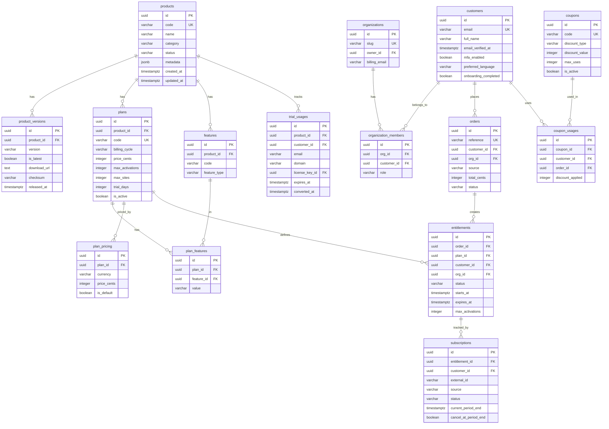
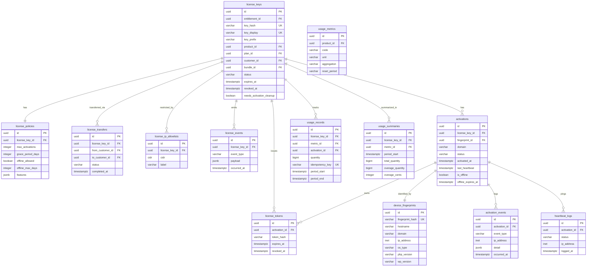
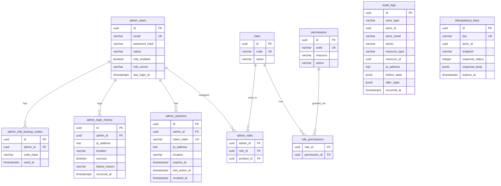
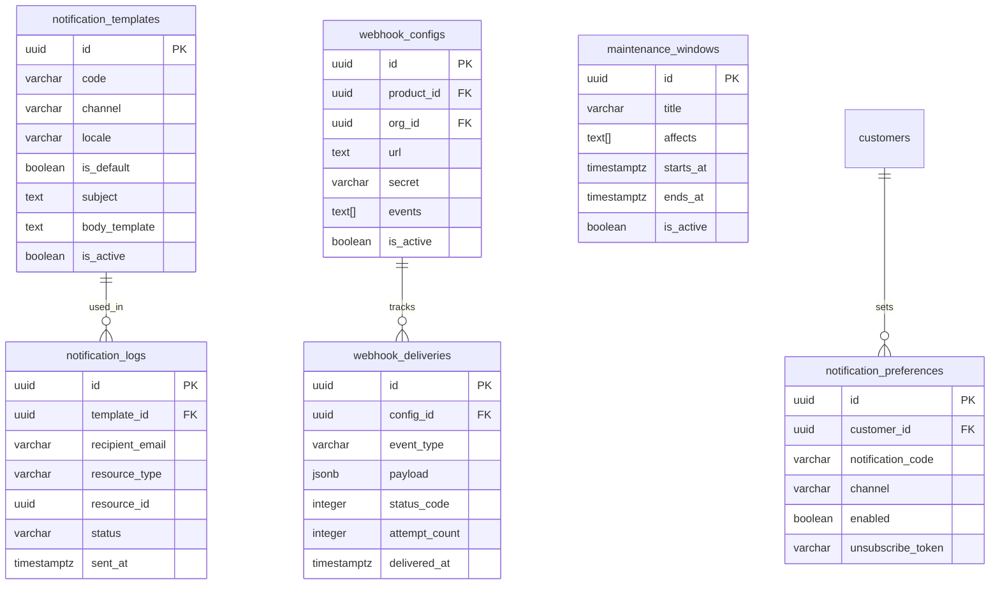
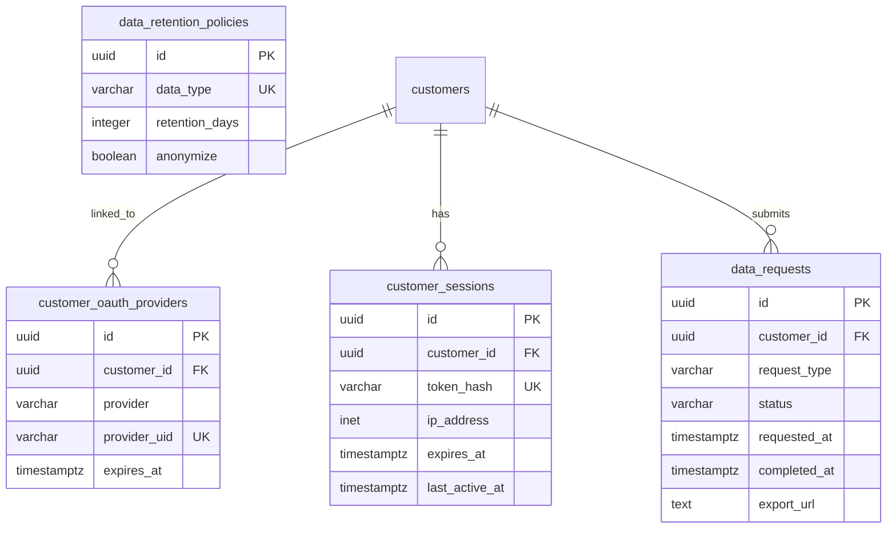
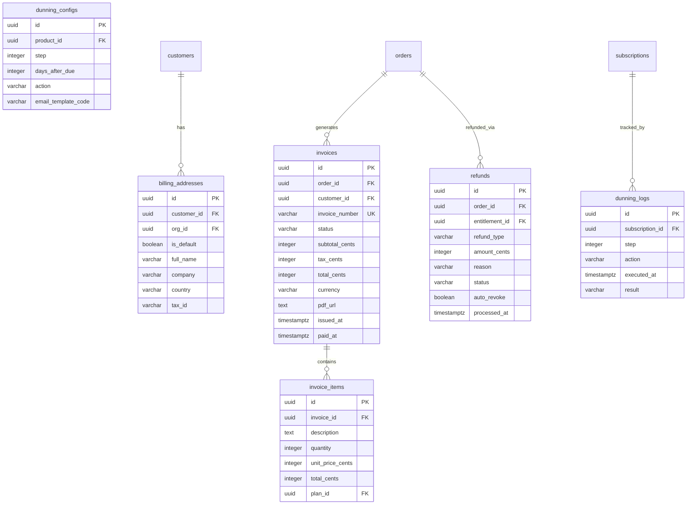
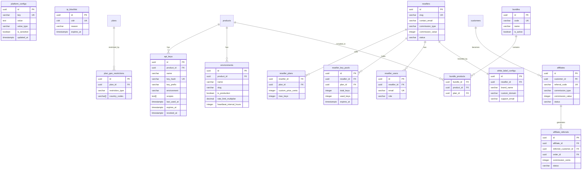

# License Platform — Entity Relationship Diagram
## Version: 1.0 | April 2026

Diagram dùng **Mermaid ERD syntax** — render trực tiếp trong GitHub, GitLab, Notion, hoặc [mermaid.live](https://mermaid.live).

---

## Domain 1 & 2: CATALOG + ENTITLEMENT

---

## Domain 3 & 4: LICENSE + ACTIVATION

---

## Domain 5: GOVERNANCE

---

## Domain 6: NOTIFICATION

---

## Domain 7: CUSTOMER PORTAL

---

## Domain 8: BILLING

---

## Domain 9: PLATFORM & RESELLER

---

## Full Entity Count

| Domain | Tables |
|---|---|
| CATALOG | products, product_versions, plans, features, plan_features, plan_pricing |
| ENTITLEMENT | customers, organizations, organization_members, orders, entitlements, subscriptions, coupons, coupon_usages, trial_usages |
| LICENSE | license_keys, license_policies, license_tokens, license_transfers, license_ip_allowlists, license_events |
| ACTIVATION | device_fingerprints, activations, activation_events, heartbeat_logs, usage_metrics, usage_records, usage_summaries |
| GOVERNANCE | admin_users, roles, permissions, role_permissions, admin_roles, audit_logs, admin_sessions, admin_login_history, admin_mfa_backup_codes, idempotency_keys |
| NOTIFICATION | notification_templates, notification_logs, notification_preferences, webhook_configs, webhook_deliveries, maintenance_windows |
| CUSTOMER PORTAL | customer_oauth_providers, customer_sessions, data_requests, data_retention_policies |
| BILLING | billing_addresses, invoices, invoice_items, refunds, dunning_configs, dunning_logs |
| PLATFORM | api_keys, environments, platform_configs, ip_blocklist, plan_geo_restrictions |
| RESELLER | resellers, reseller_plans, reseller_key_pools, reseller_users, white_label_configs |
| AFFILIATE | affiliates, affiliate_referrals |
| BUNDLE | bundles, bundle_products |
| **Total** | **~55 tables** |
